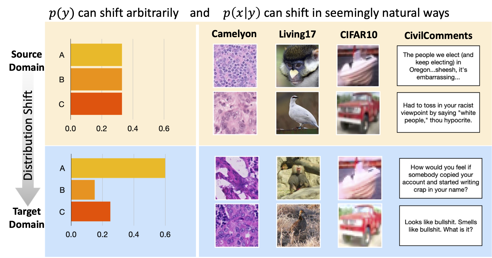
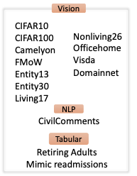

[](https://sites.google.com/view/rlsbench/)


`RLSbench` is the official implementation of [RLSbench: Domain Adaptation Under Relaxed Label Shift](https://arxiv.org/abs/2302.03020). We release datasets to get the code setup and replicate the results in the paper.


## Paper
For more details, refer to the accompanying paper: 
[RLSbench: Domain Adaptation Under Relaxed Label Shift](https://arxiv.org/abs/2302.03020). If you have questions, please feel free to reach us at sgarg2@andrew.cmu.edu or open an issue.  




If you find this repository useful or use this code in your research, please cite the following paper: 

> Garg, S., Erickson, N., Sharpnack, J., Smola, A., Balakrishnan, S., Lipton, Z. (2023). RLSbench: Domain Adaptation Under Relaxed Label Shift. arxiv preprint  arXiv:2302.03020. 
```
@article{garg2023RLSBench,
    title={RLSbench: Domain Adaptation Under Relaxed Label Shift},
    author={Garg, Saurabh and Erickson, Nick and Sharpnack, James and Smola, Alex and Balakrishnan, Sivaraman and Lipton, Zachary},
    year={2023}, 
    journal={arXiv preprint arXiv:2302.03020}
}
```

### Installation

To install `RLSbench`, run:
```python
pip install -e .
```

To install latest version of `RLSbench` as a package, run:

```python
pip install git+https://github.com/acmi-lab/RLSbench
```

## Datasets 


## Dataset Setup 
To setup different datasets, run the scrips in `dataset_scripts` folder. Except for Imagenet dataset which can be downloaded from the [official website](https://www.image-net.org/download.php), the scripts set up all the datasets (including all the source and target pairs) used in our study.

## Overview

Overall pipeline: 

The following are the crucial parts of the code:

1. `label_shift_utils.py`: This files contains utils functions to simulate label shift in the target data. 
2. `./datasets/get_dataset.py`: This file contains the code to get the source and target datasets.
3. `./algorithms/`: This folder contains the code for different algorithms. We implement the follwing domain algorithms:  
    - ERM variants: ERM, ERM-aug, with different pretraining techniques like ['rand', 'imagenet', 'clip', 'bert']
    - Domain alignment methods: DANN, CDAN, IW-DANN, IW-CDAN
    - Self-training methods: Noisy student, Pseudolabeling, FixMatch, SENTRY
    - Test time adaptation methods: BN_adapt, TENT,  CORAL 


The entry point of the code is `run_main.py`. `config` folder contains default parameters and hyperparameters needed for base experiments for the project. We need to pass the dataset name and the algorithm name with flag `--dataset` and `--algorithm` to the `run_main.py` file. To simulate label shift, we need to pass the flag `--simulate_label_shift` and the dirchilet sampling parameter with `--dirchilet_alpha`. And the flag `--root_dir` is used to specified the data directory for source and target datasets.

Caveat: For Test Time Adaptation (TTA) methods, we need to provide the folder with ERM-aug trained models with the parameter `--source_model_path`.

### Results Logging 
The code evaluates the models trained and logs the results in the `./logs/` folder in form of a csv file. 

## License
This repository is licensed under the terms of the [MIT License](LICENSE).

